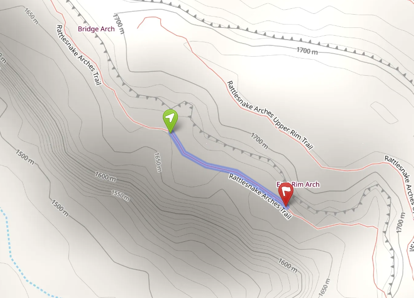
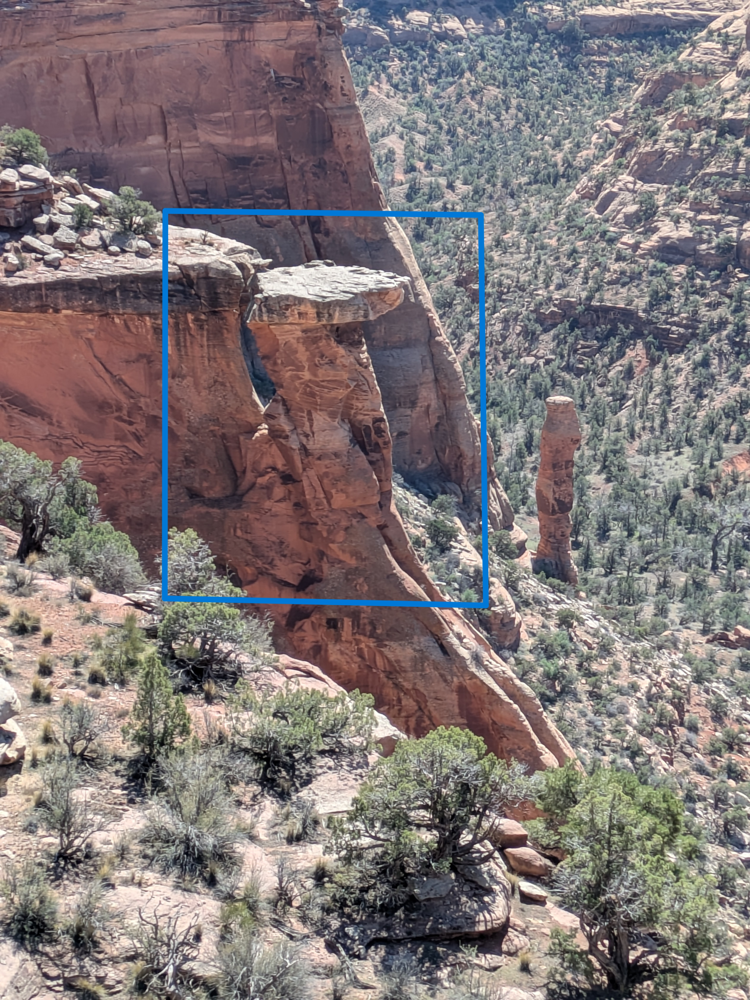
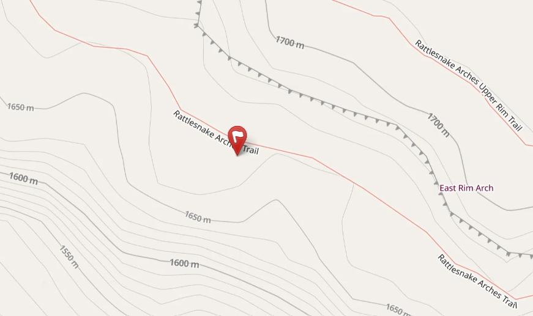

Near where the arches stretch,  
And canyon breezes softly fetch,  
You’ll see a shape that’s quite a sight,  
Bathed in desert golden light.  

A cobra rising from the ground,  
The finest statue to be found.  
It fans a hood of dusty red,  
And rears its heavy, stony head.  

It looks as if it might attack,  
With eyes that watch the canyon track.  
But do not run in fear or fright,  
It hasn't moved in all of light.  

For this is just a rock, you see,  
No venom for you or for me.  
It has no fangs, no tail, no tongue,    
Just ancient grains of sand, unsung.  

::: {.panel-tabset}

## Hints
*Click to expand the sections below.*  

::: {.callout-tip collapse="true"}
## Hint #1: Help...what am I looking for?

Above Rattlesnake Canyon, you'll find a rock shaped like a cobra with its head raised high.

:::

::: {.callout-tip collapse="true"}
## Hint #2: In what general area should I look?

:::

::: {.callout-tip collapse="true"}
## Hint #3: Ok, I need a photo hint please.

{.img-blur2}

:::

## Answer

::: {.callout-tip appearance="minimal" collapse="false"}

GPS coordinates of this photo: 39.14455, -108.84978

:::