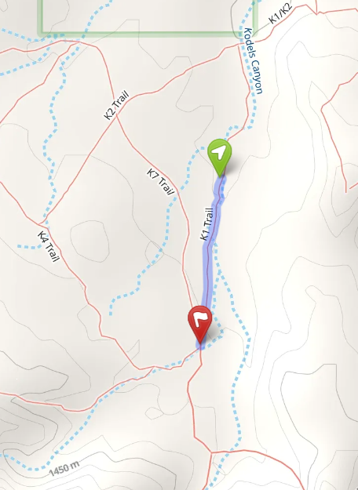
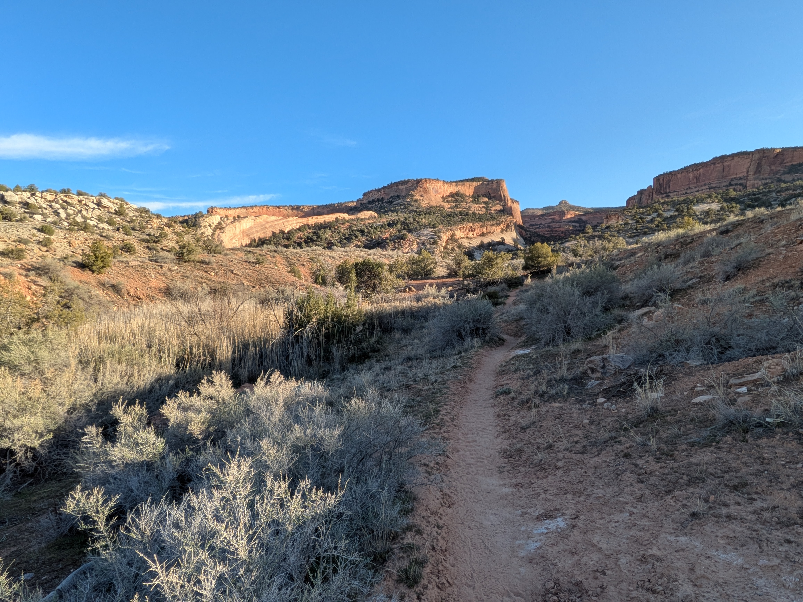
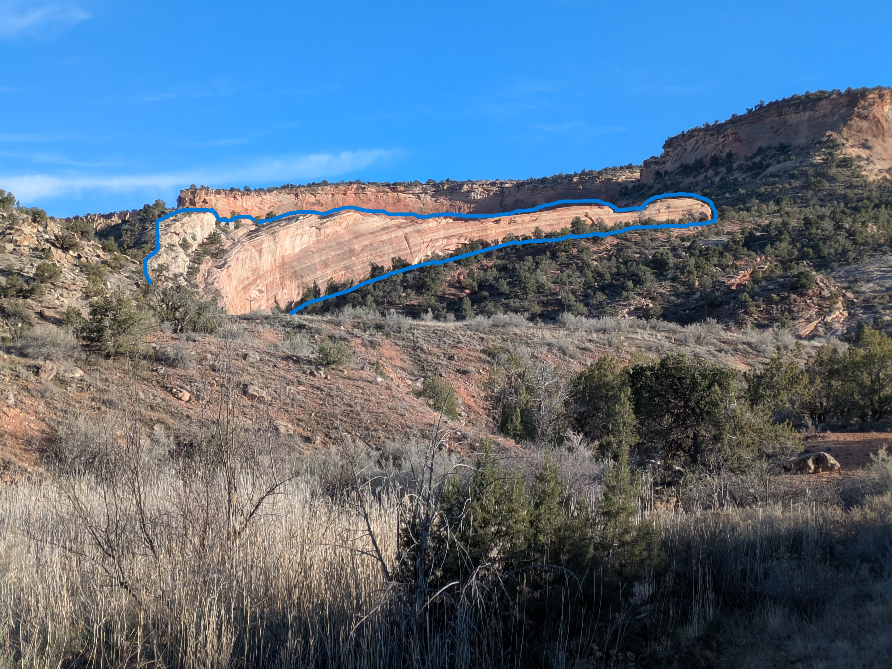
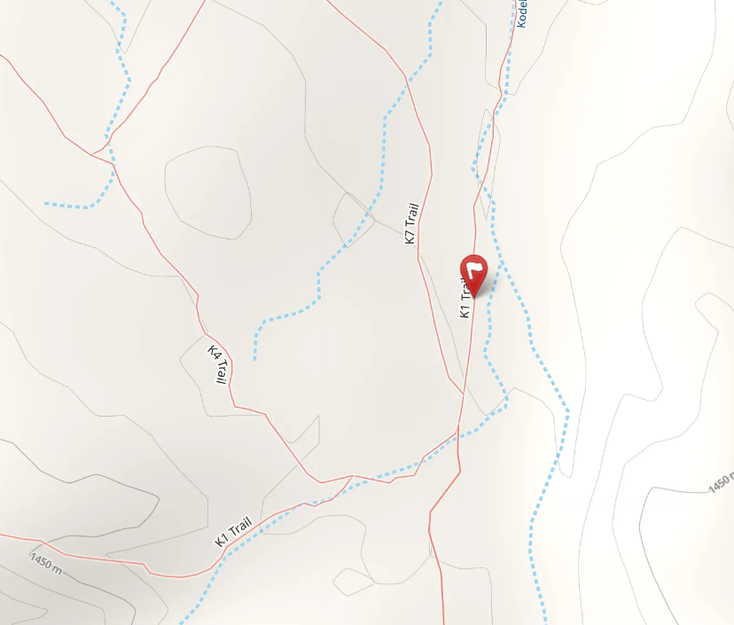

A thousand-foot dreamer in ribbons of red,  
On a pillow of desert, he’s resting his head.  
His wings are tucked tight in a neat stony fold,  
A secret in sandstone, slowly being told.  

As you walk by his side, it’s hard not to gape,  
At the beast who's been waiting to make his escape.  
Only half his bulk has emerged from the ground,  
He slumbers in silence, heavy and profound.  

His snout points uphill, aimed straight for the park,  
Wait, did his eyelid just flicker…maybe spark?  
He’s counting on raindrops and frost-wedging art,  
To loosen the earth from his lower-half part.  

He needs just a bit more erosion to show,  
The rest of his tail, then he’s ready to go.  
But for now he’s content to dream in the sun,  
A dragon whose waiting has only begun.  

::: {.panel-tabset}

## Hints
*Click to expand the sections below.*  

::: {.callout-tip collapse="true"}
## Hint #1: Help...what am I looking for?

Somewhere on the K1 trail, you'll find a large rock formation shaped like a dragon who is laying on the ground fast asleep.  

:::

::: {.callout-tip collapse="true"}
## Hint #2: In what general area should I look?

:::

::: {.callout-tip collapse="true"}
## Hint #3: Ok, I need a photo hint please.

{.img-blur2}

:::

## Answer

::: {.callout-tip appearance="minimal" collapse="false"}

GPS coordinates of this photo: 39.12734, -108.74400

:::