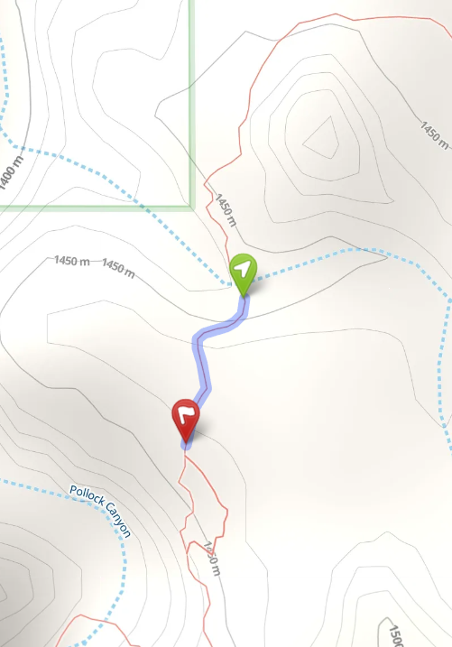
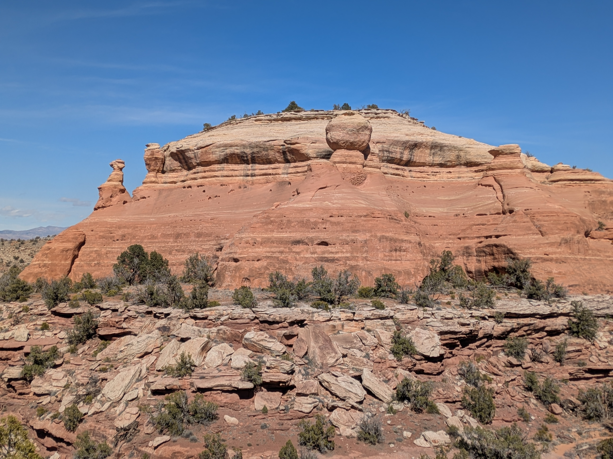
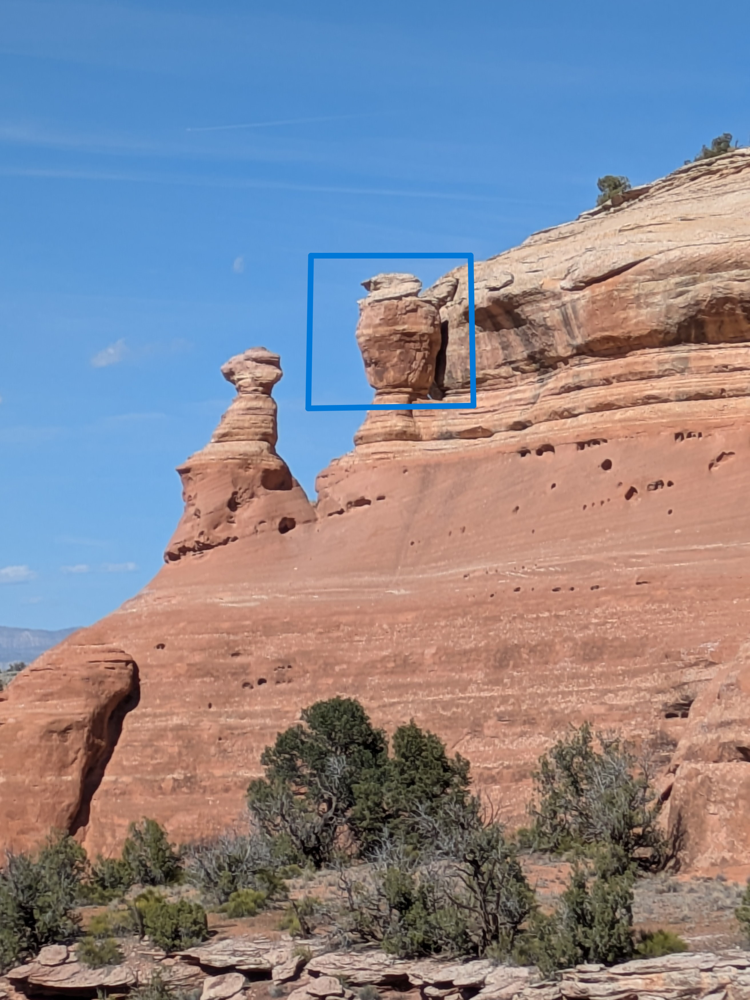
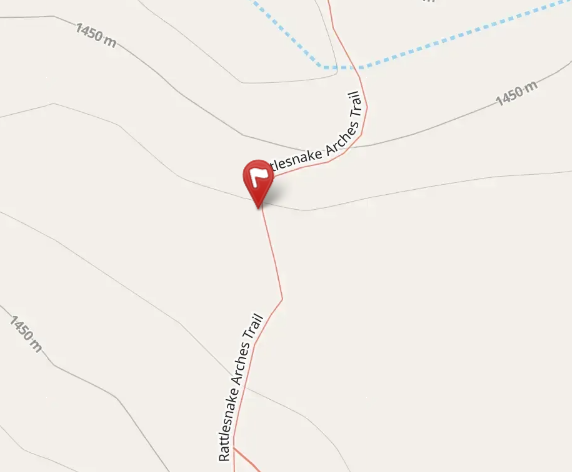

There upon the cliff, a figure appears,  
Watching over the desert through millions of years.  
Its body is dark, like a shade or a shroud,  
Silent and stoic, distinct and proud.  

But look at that neck! It's a ring made of light,  
Pure snowy stone shining dazzlingly bright.  
A collar of white, like a scarf she has worn,  
Since the first stars of the galaxy were born.  

She scans for a meal with a hunter’s glare,  
But with a tummy of rock she eats only air.  
She wants to take off and to soar in the view,  
Stuck to the wall, nothing much she can do.    

So give her a wave as you round the bend,  
As always, she'll be busy chasing the wind.  
The bald eagle bird with the ruff of the snow,  
Is stone-still but putting on quite a show.  

::: {.panel-tabset}

## Hints
*Click to expand the sections below.*  

::: {.callout-tip collapse="true"}
## Hint #1: Help...what am I looking for?

Somewhere on the R1 trail, you'll find a rock shaped like an eagle, standing tall above the canyon below.
:::

::: {.callout-tip collapse="true"}
## Hint #2: In what general area should I look?

:::

::: {.callout-tip collapse="true"}
## Hint #3: Ok, I need a photo hint please.

{.img-blur2}

:::

## Answer

::: {.callout-tip appearance="minimal" collapse="false"}

GPS coordinates of this photo: 39.14879, -108.80768  

:::