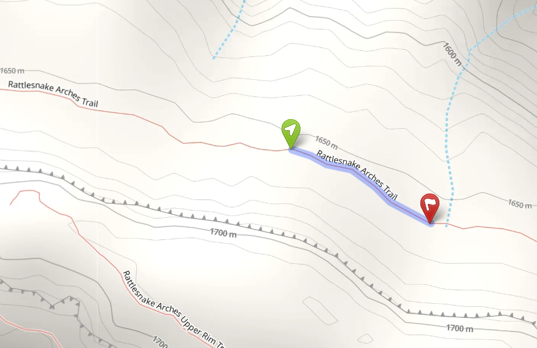
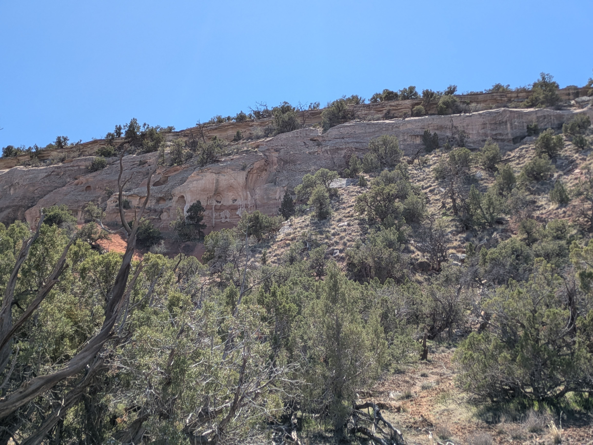
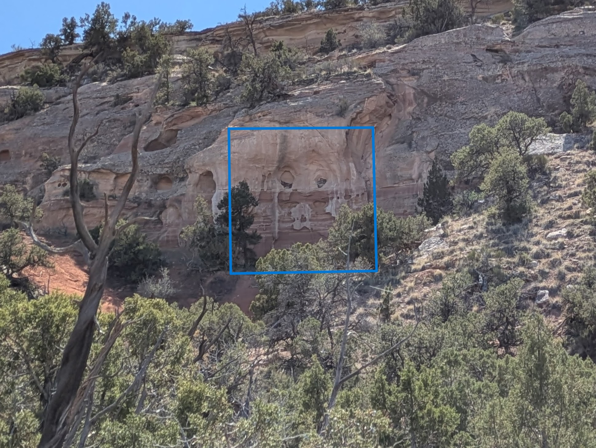
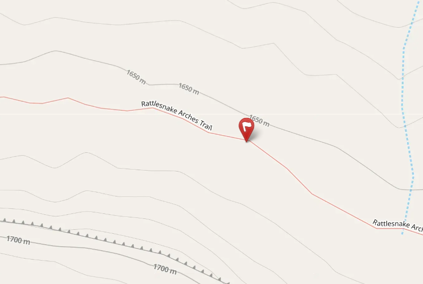

Along the trail's winding way,  
A pucker stops, brightens your day,  
With lips pursed tight in stone surprise,  
A smooch that hangs before your eyes.  

No artist hand or potter’s clay,  
A kissy-face built the R1 way.  
From grains of rock and wind-filled days,  
Left out here for us to praise.  

Accidental emoji from ancient art,  
Still stole my playful desert heart.  
So blow a kiss, back to the sky,  
And let your happy spirits fly.  

::: {.panel-tabset}

## Hints
*Click to expand the sections below.*  

::: {.callout-tip collapse="true"}
## Hint #1: Help...what am I looking for?

Look closely and you'll find something that resembles a kissy-face emoji near the R1 trail.
:::

::: {.callout-tip collapse="true"}
## Hint #2: In what general area should I look?

:::

::: {.callout-tip collapse="true"}
## Hint #3: Ok, I need a photo hint please.

{.img-blur1}

:::

## Answer

::: {.callout-tip appearance="minimal" collapse="false"}

GPS coordinates of this photo: 39.14691, -108.84625

:::