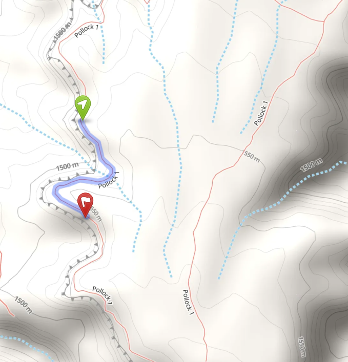
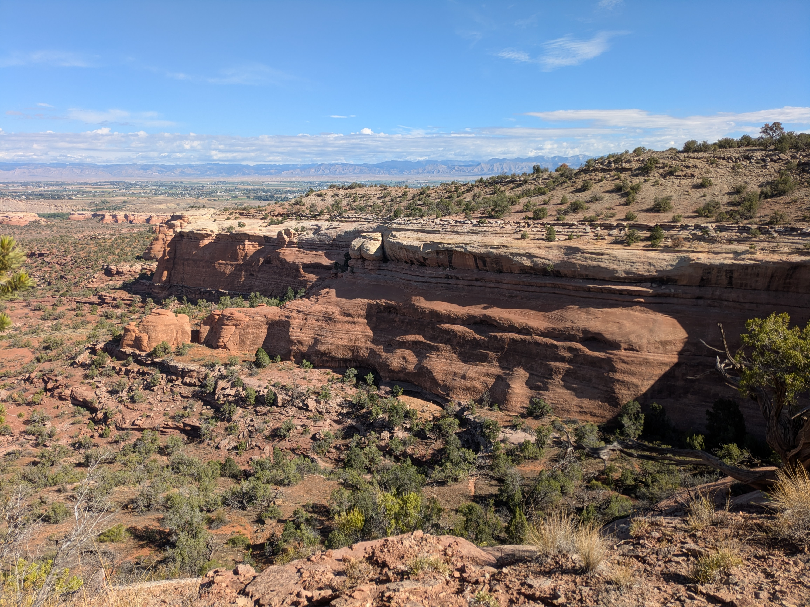
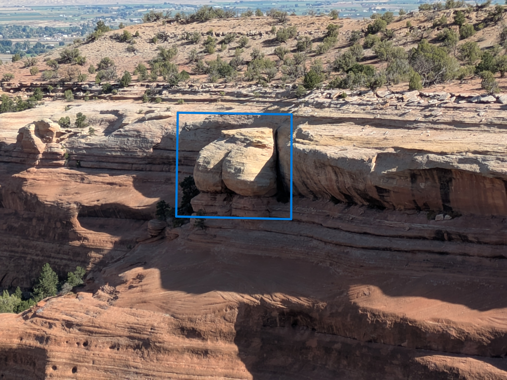
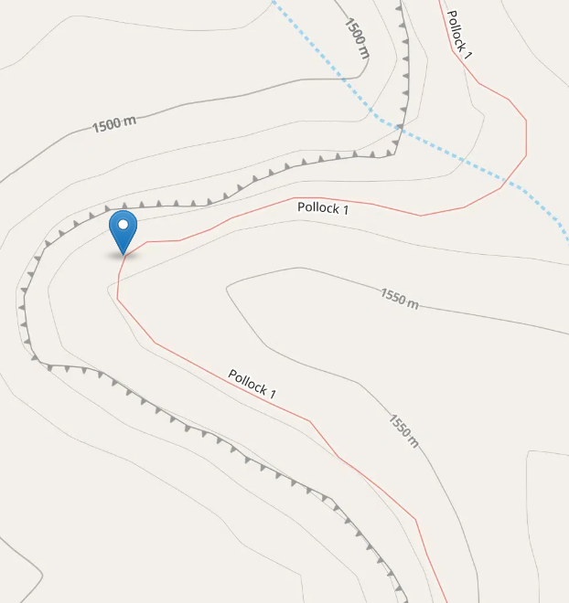

Up on the bench where the canyon runs wide,  
A plump pair of cheeks tops the trail’s west side.  
No legs and no torso, no arms to embrace,  
Just two solid glutes, holding firm in their place.  

No matter the season, no matter the phase,  
It's always a full moon up Pollock a ways.  
It looks like whoever got stuck on that rim,  
Never once missed leg day, never skipped the gym.  

So hike clockwise along with your eyes on the prize,  
Hold a steady watch outward for nature's surprise.  
Continue and you'll find, just as the trail turns,  
The palest backside that never quite burns.  

Beneath the junipers, unbothered and bare,  
Without any shorts, or discreet underwear.  
These beautiful buns that have no need to hide,  
Just waiting for you on Pollock’s backside.  

::: {.panel-tabset}

## Hints
*Click to expand the sections below.*  

::: {.callout-tip collapse="true"}
## Hint #1: Help...what am I looking for?

Somewhere on the P1 trail, you'll find a rock formation that looks like two plump butt cheeks.  

:::

::: {.callout-tip collapse="true"}
## Hint #2: In what general area should I look?

:::

::: {.callout-tip collapse="true"}
## Hint #3: Ok, I need a photo hint please.

{.img-blur2}

:::

## Answer

::: {.callout-tip appearance="minimal" collapse="false"}

GPS coordinates of this photo: 39.14136, -108.80566

[Click for interactive map](https://www.openstreetmap.org/?mlat=39.14136&mlon=-108.80566&zoom=19)

:::