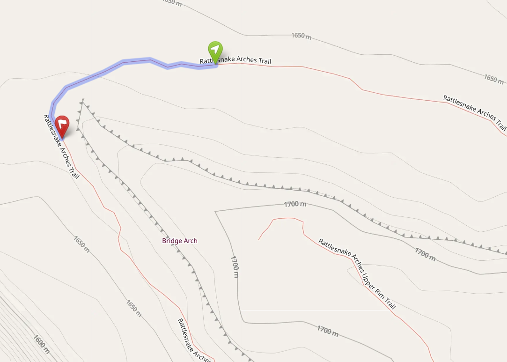
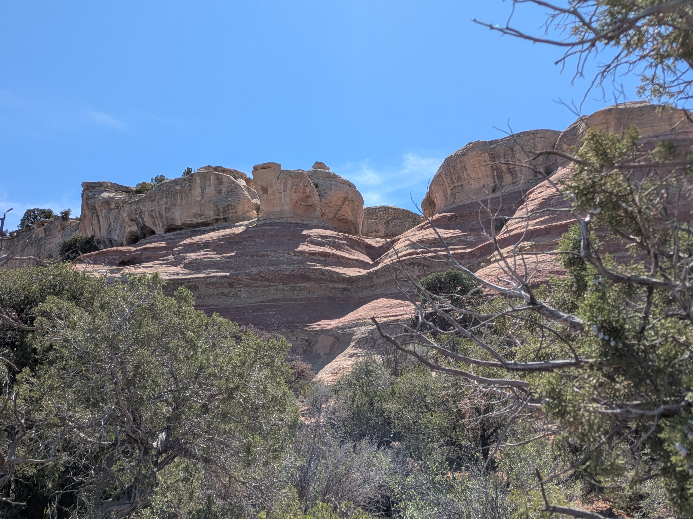
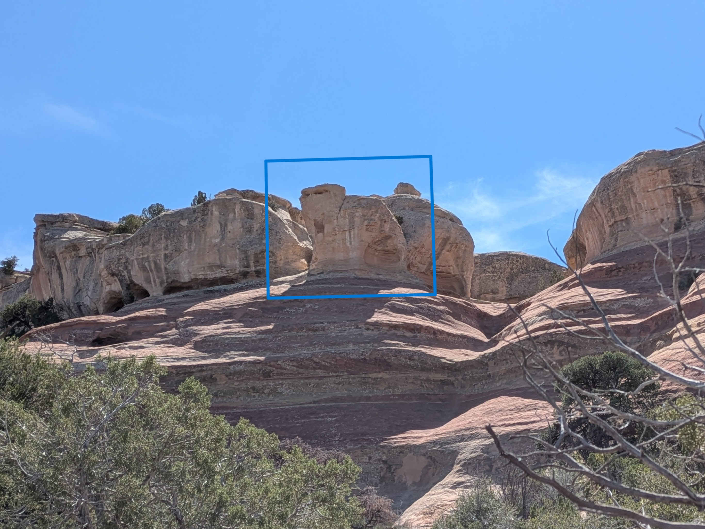
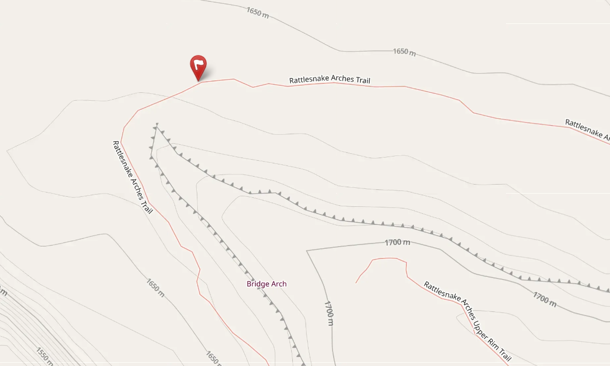

As the R1 trail begins to bend,  
After all the steepest climbing ends,  
There, upon a level seat,  
A grumpy snail takes the heat.  

His shell is pale, a sandy cream,  
A sun-bleached, prehistoric gleam.  
But look into his rocky face,  
He seems to loathe this quiet place.  

With narrowed eyes and stony glare,  
He watches hikers unaware.  
Perhaps he’s cross because he’s stuck,  
With prehistoric, sluggish luck.  

He wished to reach the canyon floor,  
A million years ago or more.  
But mid-way down he took a nap,  
And fell into a sandstone trap.  

So if you pass his craggy seat,  
Be sure to move with nimble feet.  
For though he’s still as still can be,  
He’s quite a cranky sight to see.  

::: {.panel-tabset}

## Hints
*Click to expand the sections below.*  

::: {.callout-tip collapse="true"}
## Hint #1: Help...what am I looking for?

A rock that looks like a snail who is glaring out at the bench below with narrowed eyes.
:::

::: {.callout-tip collapse="true"}
## Hint #2: In what general area should I look?

:::

::: {.callout-tip collapse="true"}
## Hint #3: Ok, I need a photo hint please.

{.img-blur2}

:::

## Answer

::: {.callout-tip appearance="minimal" collapse="false"}

GPS coordinates of this photo: 39.14879, -108.80768  

:::